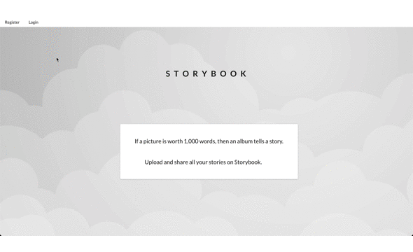

# Storybook
A website for users to display collections of photos built using **Ruby on Rails** and **React**. UI built with **Semantic UI React**. Other libraries used were: **React Router**, **Redux**, and **React Responsive Carousel**. My goal was to have a simple website for users to store, look at their photos, and see photos other users have shared. 

## Functionality

### Overview

Users can sign up, upload, and share small photo albums. There are three pages, the first being the *My Stories* page where a user can see all of their photo albums that they've uploaded. The second page is the *Explore* page where users can see all the publicly shared photo albums of other users. The third page is the *Upload* page where a user can upload their photos and see previews of them.

### Structure

The backend is a Rails API with a Postgres database. The schema is made of three models: User, Photostory, and Photo. A user has many photostories which contain many photos. For security I used the Bcrypt gem to hash passwords, and JWT as my Auth token. The Carrierwave gem handles photo uploads to the backend. The frontend is built with React with two components that use Redux to make the handling of state easier. The frontend sends tokens in the header of its requests to the backend, along with upload information. When a user uploads a photo it either creates a photostory that holds that photo, or it adds the photo to an existing photostory with the same title.

### Other Features

When a user is at their *My Stories* page they can click on a specific Story which will render the Photostory component. This component will map large photos (as opposed to the small photos that it renders for the *My Stories* page), which the user can click on and trigger a modal with a full sized version of the photo. The user can also click on **Slideshow** to trigger a photo carousel of the photos in that Story. The user can also edit the captions for any of the photos and that will be updated on the backend and rendered on the page.

## Limitations
This application was built for desktop first so it is currently not optimized for mobile users. I'm working on making it more mobile friendly. Another problem with the way I'm handling data means that a user can only upload one photo at a time. The next step in this project is to reconfigure the upload form and backend to make uploading many photos at once more intuitive for users. The other major limitation at this time is the inability for users to share a link to their photo.

If I were to redo this project I would split the responsibilities of the backend more. Currently the responsibilities of the Photostory Controller and the Photo Controller on the backend overlap too much. A stricter adherence to the Single Responsibility Principle would have benefitted this project. I would also adds tests to this project. Having to manually uploaded photos in order to test out changes slowed down development.

One other thing that needs to be worked on is refactoring the code. Abstracting away all the actions and reducers would be the next step in cleaning up this code.

## Demo
Here's a [link](https://youtu.be/x14MywZMmEA "Storybook Demo") to a Youtube video of the demo for this repo.

Here's a [link](https://storybook-photo.herokuapp.com/ "Storybook Heroku Demo") to this repo hosted on Heroku. There is an issue with photos being wiped from the database once the backend that's hosted on Heroku goes to sleep (if the user hasn't logged in for a prolonged amount of time). Have to investigate whether this can be fixed.

## Resume

A [link](https://docs.google.com/presentation/d/1S570OxwmrnVDVA3jpRpa8W4f_0ao1AvJSVQNcujGlro/edit?usp=sharing "Aleks' Resume") to my resume.